maven：https://mvnrepository.com/

springboot：https://start.spring.io/

SMTP：163：MSSRKLUUVELDZIOO	新浪：b786bf1f5627db29

`aop、web、thymeleaf、devtools`

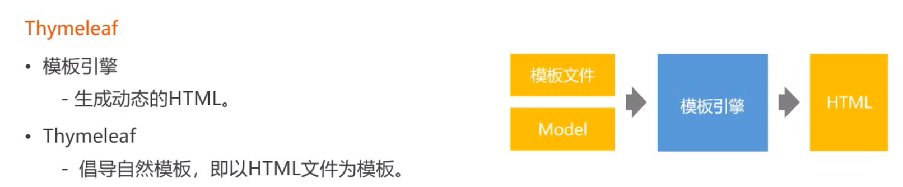


# 开发流程


## 1、网站首页

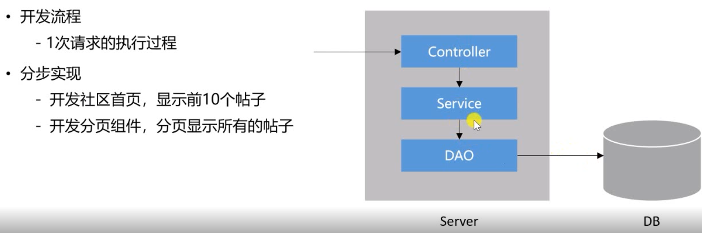


## 2、登录模块

### 2.1、发送邮件

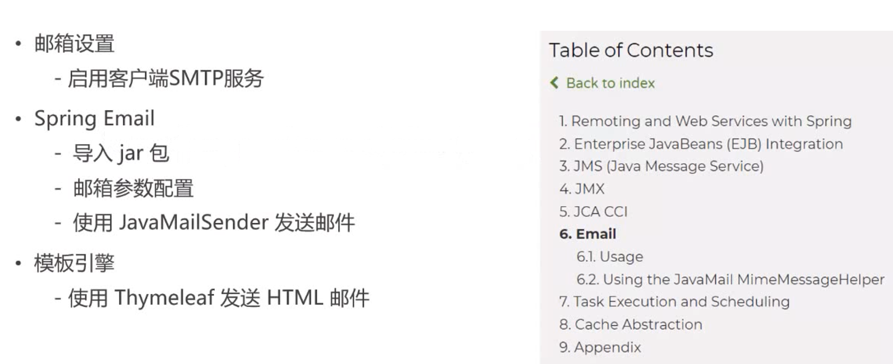

- **Spring Email**
  - 添加依赖、配置属性
  - 在 util包下创建 MailClient类 实现邮件发送功能
  - 使用 Thymeleaf模板，创建 MailTests测试 

**开启SMTP后password 使用授权码登录**

```xml
<!-- https://mvnrepository.com/artifact/org.springframework.boot/spring-boot-starter-mail -->
<dependency>
   <groupId>org.springframework.boot</groupId>
   <artifactId>spring-boot-starter-mail</artifactId>
   <version>2.2.0.RELEASE</version>
</dependency>
```

```properties
spring.mail.host=smtp.sina.com
spring.mail.port=465
spring.mail.username=zhujiangwork@sina.com
spring.mail.password=b786bf1f5627db29
spring.mail.protocol=smtps
spring.mail.properties.mail.smtp.ssl.enable=true
```


### 2.2、注册功能

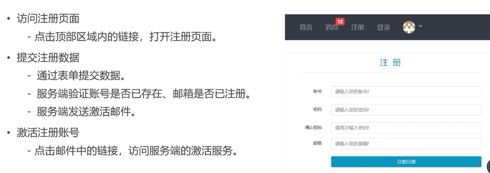


- **访问注册页面**
  - 创建LoginController.class，getRegisterPage() 方法"/register"
  - 修改register.xml，复用index.xml 头和尾，修改 index.xml 头部 注册

首页、注册等页面头部相同，可通过 `th:fragment、th:replace` 复用


- **提交注册数据**

  - 添加依赖、配置属性，创建CommunityUtil.class、generaterUUID() 和 md5() 方法
  - UserService下创建 register()方法
    - 判断为空（user, username, password, email）
    - 验证账号、验证邮箱
    - 注册用户
    - 发送激活邮件
  - LoginController.class下创建 register()方法，注册成功跳转激活页面"/site/operate-result"（一段时间后或点击跳转首页），失败就跳转原页面 "/site/register" 并提示错误信息，同时保留原注册信息（在表单中设置默认值为上一次使用的值）
  - 工具包中创建 CommunityConstant接口，设置激活状态（成功、重复激活、失败）
  - UserService下创建activition()方法判断为何种状态
  - LoginController.class下创建 activition()方法获取路径中的id和activationCode，根据service层的状态来跳转（激活成功跳转登录页面、其余跳转主页）
  - 创建 getLoginPage() 方法"/login"

  

`apache.commons`：对常用类的封装，使用更简便。有`String.Utils、DigestUtils`

```xml
<!-- https://mvnrepository.com/artifact/org.apache.commons/commons-lang3 -->
<dependency>
    <groupId>org.apache.commons</groupId>
    <artifactId>commons-lang3</artifactId>
    <version>3.9</version>
</dependency>
```

配置服务器域名，这里使用本机地址

```properties
# community
community.path.domain=http://localhost:8080
```

 

### (会话管理)

1. 粘性session：session不一致

2. 同步session：同步影响性能，耦合高

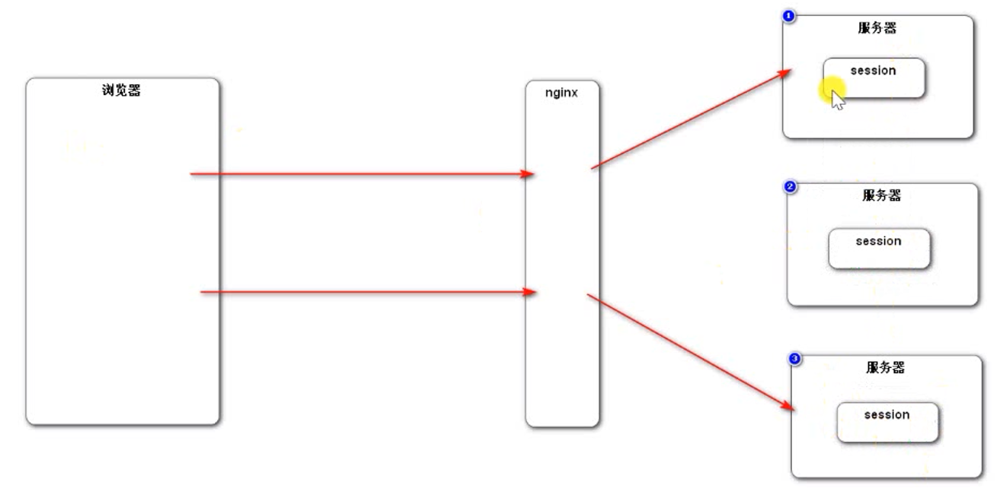

3. 共享session：所有session依赖一个服务器


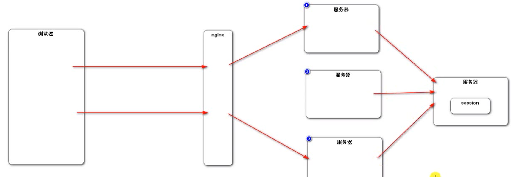

4. 推荐：尽量使用cookie，或者存本地数据库中

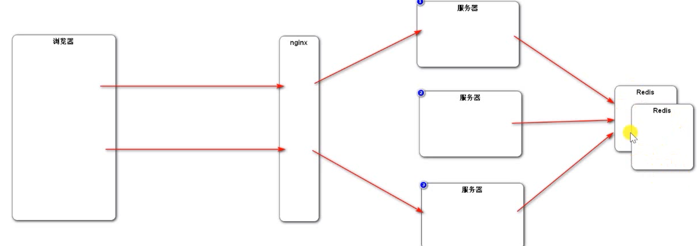


### 2.3、验证码

Kaptcha：https://code.google.com/archive/p/kaptcha

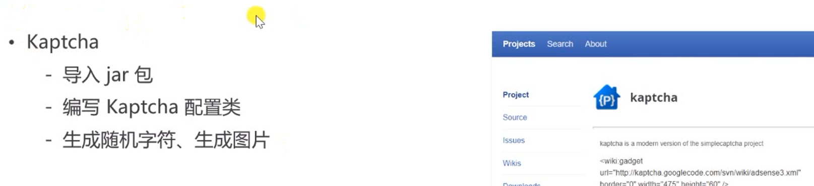


- Kaptcha
  - 添加依赖，在Config 包下创建配置类 KaptchaConfig.class，创建 kaptchaProducer() 方法设置验证码属性
  - 需要一个生成验证码图片的页面
    - LoginController.class下创建 getKaptcha()方法 "/kaptcha"
    - 生成验证码及图片
    - 将验证码传入session
    - 将图片返回网页
    - login.html 中图片链接指向验证码页面
  - login.html底部写 js 实现 刷新验证码 按钮功能 refresh_kaptcha()

```xml
<!-- https://mvnrepository.com/artifact/com.github.penggle/kaptcha -->
<dependency>
    <groupId>com.github.penggle</groupId>
    <artifactId>kaptcha</artifactId>
    <version>2.3.2</version>
</dependency>
```


### 2.4、登录、退出功能

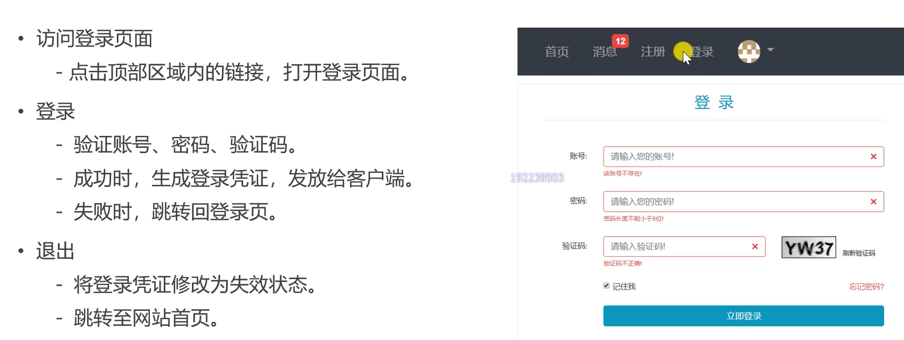


- 访问登录页面
  
- 修改login.xml，复用index.xml 头和尾，修改 index.xml 头部 注册
  
- 登录

  - Dao：创建实体登录凭证 LoginTicket.class，创建LoginTicketMapper.class：增加凭证、根据 ticket查询凭证、修改凭证状态，创建 loginticket-mapper.xml实现及测试

  - Service：UserService.class创建 login()方法实现用户登录，判断为空（username, password）、验证账号、状态、密码、生成登录凭证

  - Controller：LoginController.class下创建 login()方法 "/login"：检查验证码、检查账号,密码，正确跳转主页，错误跳转本页

  - index：

    ```xml
    <form class="mt-5" method="post" th:action="@{/login}">
        <input type="text"
               th:class="|form-control ${usernameMsg!=null?'is-invalid':''}|"
               th:value="${param.username}"
               id="username" name="username" placeholder="请输入您的账号!" required>
            <div class="invalid-feedback" th:text="${usernameMsg}">
                该账号不存在!
            </div>
    ```

- 退出

  - Service：UserService.class创建 logout()方法实现用户退出：改变 state状态为1
  - Controller：LoginController.class下创建 logout()方法 "/logout"：退出跳转登录页面
  - index：修改 index头部的退出


### 2.5、显示登录信息（拦截器）

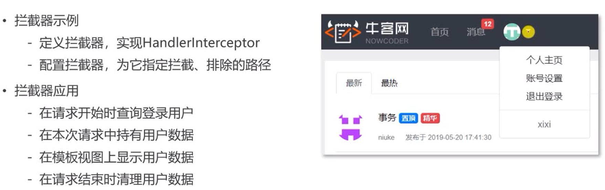


- 拦截器示例
  - controller：创建 interceptor包，创建 LoginTicketInterceptor 类实现 HandlerInterceptor接口（三个重写方法：**在Controller之前执行、在Controller之后执行、在TemplateEngine之后执行**）
  - config：创建WebMvcConfig类实现 WebMvcConfigurer接口，重写 addInterceptors() 方法添加拦截器，设置拦截 `addPathPatterns("/register", "/login")`、忽略 `excludePathPatterns("/**/*.css", "/**/*.js", "/**/*.png", "/**/*.jpg", "/**/*.jpeg") `

- 拦截器应用

  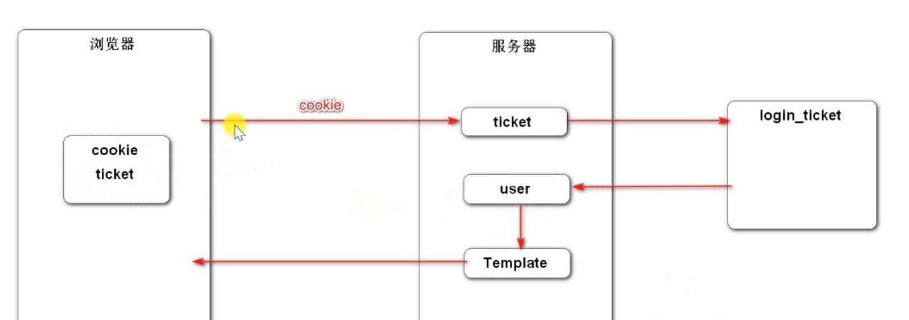

  - LoginTicketInterceptor.class 重写 preHandle() 方法：从cookie中获取 ticket（创建CookieUtil，从请求中获取ticket ）、根据 ticket 查询 登录凭证、检查凭证是否有效、根据凭证查询用户、在本次请求中持有用户
  - 重写 postHandle() 方法：在模板视图上显示用户数据
  - 重写 afterCompletion() 方法：请求结束时清理用户数据
  -  在 addInterceptors() 方法 下添加 LoginTicketInterceptor 拦截器


### 2.6、账号设置

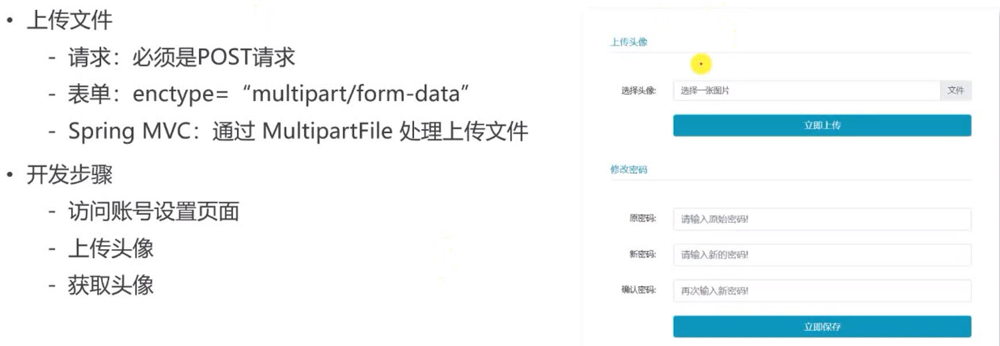

- 访问账号页面

  - 创建 UserController ("/user")，创建getSettingPage() "/setting" 访问 "/site/setting".xml，修改index.xml 头部链接

- 上传头像

  - 配置资源存放路径

    ```properties
    community.path.upload=d:/Data/newcoder/upload
    ```

  - Service：UserService.class创建 updateHeader() 方法实现换头像

  - Controller：LoginController.class下创建 uploadHead()方法 "/upload"：更新头像（MultipartFile），失败跳转原页面，成功重定向首页

    - 判断头像是否为 null
    *  获取文件名、后缀名
    *  上传文件
    *  更新当前用户（从 hostHolder获取）的头像的路径（web 路径）

- 获取头像

  - LoginController.class下创建 getheader()方法 "/header/{fileName}" 读取：（将 服务器的头像 读取到 输出流中）
  - 修改 setting.html 上传头像部分

- 修改密码==（确认密码部分有问题）==

  - Service：UserService.class创建 updatePassword() 方法更新密码：原密码正确将密码修改为新密码，若错误则给与相应提示
  - Controller：LoginController.class下创建 updatePassword()方法 "/updatePassword"：原密码正确重定向到退出功能，若错误则返回到账号设置页面
  - index：修改 setting.html 修改密码部分


### 2.7、检测登录状态（自定义注解）

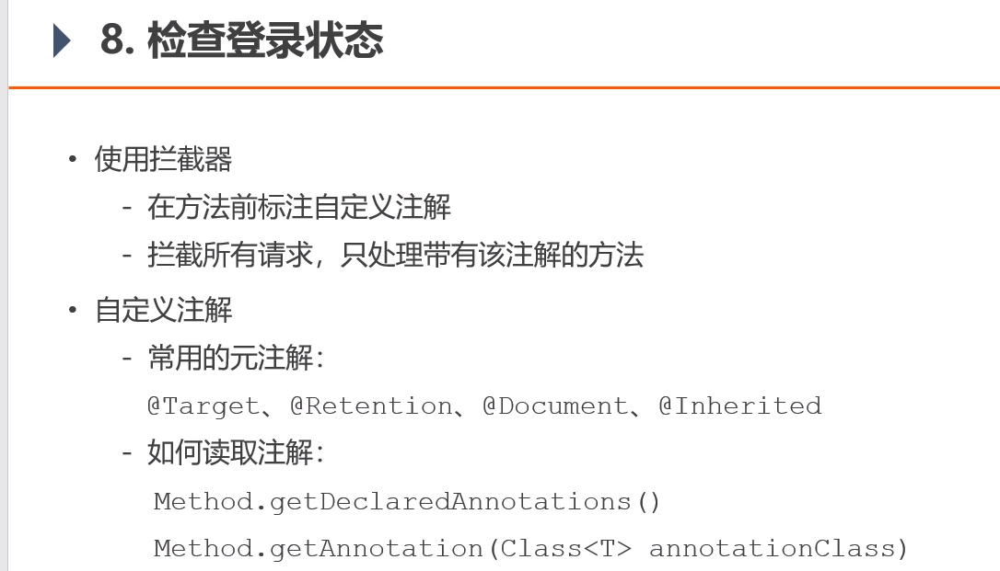


**自定义注解：**创建一个自定义注解，设置其@Target（作用域：类、方法）、@Retention（生命周期：编译、运行）、@Document（生成文档时是否带上当前自定义注解）、@Inherited（子类是否继承父类的自定义注解），就可以使用了

- **检查登陆状态：**有时候别人未登录但是知道路径也能访问登录后的页面，比如"/user/setting"，这时候就需要创建拦截器来实现拦截，利用自定义注解的方式不需要在WebMvcConfig 中一个一个指定拦截器的拦截范围（仍需 addInterceptors() 方法 添加拦截器）了，只需要在需要拦截的 Target 上使用自定义注解即可。
  - 创建 LoginRequired 注解
  - LoginRequiredInterceptor.class 重写 preHandle() 方法：若自定义注解作用的方法不为null，user为null，为恶意访问
  - 在 addInterceptors() 方法 下添加 LoginRequiredInterceptor 拦截器


## 3、核心功能

### 3.1、敏感词过滤

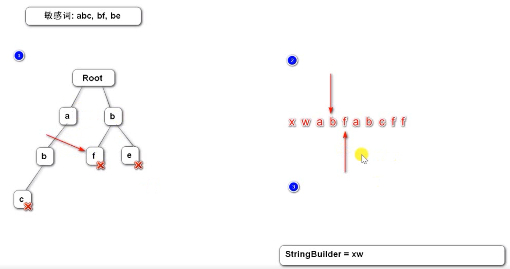


- resources 下创建文件 定义敏感词
- 创建 SensitiveFilter 工具类，实现过滤


### 3.2、发布帖子（Ajax）

#### Ajax

Ajax 允许通过与场景后面的 Web 服务器交换数据来异步更新网页。这意味着可以更新网页的部分，而不需要重新加载整个页面。

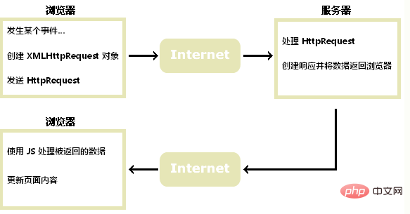

1. 网页中发生一个事件（页面加载、按钮点击）

2. 由 JavaScript 创建 XMLHttpRequest 对象

3. XMLHttpRequest 对象向 web 服务器发送请求

4. 服务器处理该请求

5. 服务器将响应发送回网页

6. 由 JavaScript 读取响应

7. 由 JavaScript 执行正确的动作（比如更新页面）


- 示例：使用 jQuery （JS框架）发送 AJAX请求（**原页面有个按钮，点击之后得到了一些数据，但网页未更新**）

  - AlphaController 下创建 testAjax() "/ajax"  （服务器处理该请求）

  ```java
  @RequestMapping(path = "/ajax", method = RequestMethod.POST)
  @ResponseBody
  public String testAjax(String name, int age) {
      System.out.println(name);
      System.out.println(age);
      return CommunityUtil.getJSONString(0, "操作成功!");
  }
  ```

  - 在 html下创建 ajax-demo.html  （服务器将响应发送回网页）

  ```html
  <!-- Ajax标准模板-->
  <script src="https://code.jquery.com/jquery-3.3.1.min.js" crossorigin="anonymous"></script>
  <script>
      function send() {
          $.post(
              "/community/alpha/ajax",
              {"name":"张三","age":23},
              function(data) {
                  console.log(typeof(data));
                  console.log(data);
  
                  data = $.parseJSON(data);
                  console.log(typeof(data));
                  console.log(data.code);
                  console.log(data.msg);
              }
          );
      }
  </script>
  ```


#### 发布帖子

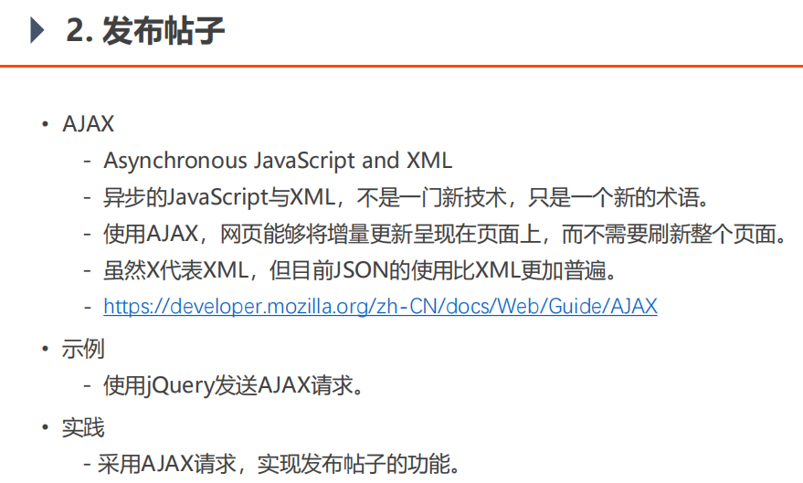

`json.toJSONString()`：将 json对象 转换成 String

`json.parseObject() `：将 String 转换成 json对象

`web浏览器` 将 Json 转换成 JS 实现前后端的交互

- 安装依赖

```xml
<!-- https://mvnrepository.com/artifact/com.alibaba/fastjson -->
<dependency>
    <groupId>com.alibaba</groupId>
    <artifactId>fastjson</artifactId>
    <version>1.2.75</version>
</dependency>
```

- CommunityUtil 类下创建 getJSONString()，实现： 构造 Json 对象并转化成 String 

- Dao：DiscussPostMapper 下创建 insertDiscussPost()，对应的 sql
- Service：DiscussPostService 下创建 addDiscussPost()，实现：创建帖子并转义html（HtmlUtils.htmlEscape()）、过滤敏感词（sensitiveFilter.filter()）

- Controller：创建DiscussPostController，addDiscussPost() "/add"：实现判断是否登录，否 利用 Json返回 403，是 创建帖子返回 0
- index：index.js 实现 index.html 我要发布 的逻辑


### 3.3、帖子详情

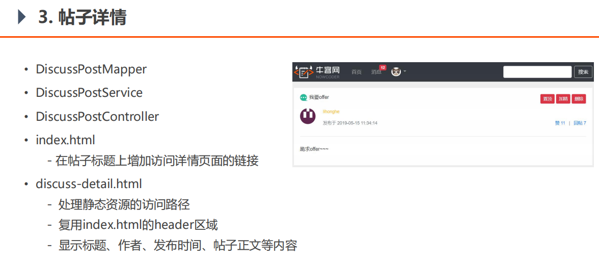

- Dao：DiscussPostMapper 下创建 selectDiscussPostById()，实现根据 id查询帖子对应的 sql
- Service：DiscussPostService 下创建 findDiscussPostById()

- Controller：getDiscussPost()  "/detail/{discussPostId}"：实现获取帖子、帖子的作者（可通过两种方式实现：mapper关联查询快、冗余、Controller查询查两次，方便，后期可缓存到redis，从redis取）
- index： index.html 在帖子标题上增加访问详情页面的链接、处理 discuss-detail.html


### 3.4、显示评论

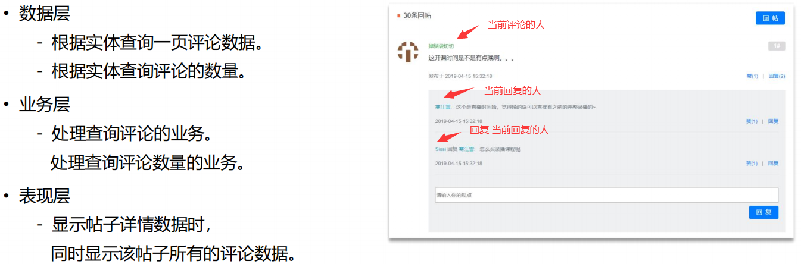


- Entity：创建 Comment 类

- Dao：创建 CommentMapper，查询每页的评论 selectCommentsByEntity()、查询评论数量 selectCountByEntity()，实现对应 sql

- Service：创建 CommentService，findCommentsByEntity()、findCommentCount()

- Controller：在 DiscussPostController 中 getDiscussPost() 下完善帖子详情（已有帖子、作者，补上分页（page实体类）、评论、回复等）

  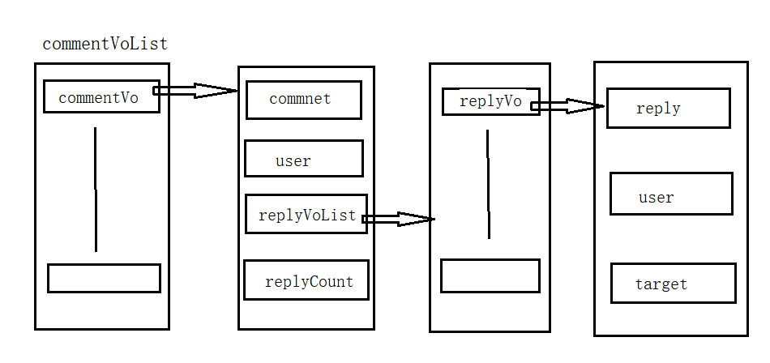

  - 设置page
  - 处理查询评论的业务
    - 评论列表：commentList 、评论VO列表：commentVoList、每条评论VO：commentVo 
    - 回复列表：replyList、回复VO列表：replyVoList、每条回复VO：replyVo
    - 如果回复了当前回复，那么当前回复 reply 的 TargetId 不为 0，存在回复 当前回复的人
  - 处理回复数量的业务
  
- View： index.html 在帖子上增加回复的数量、处理 discuss-detail.html（复用分页）


### 3.5、添加评论

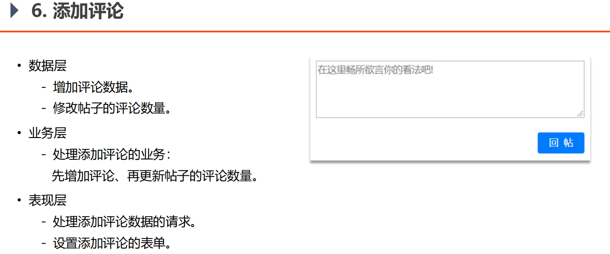

- Dao：在 CommentMapper下增加 insertComment()，实现对应 sql
  - 由于DiscussPost 中冗余存储了 commentCount 属性，增加评论后需要在 DiscussPostMapper中创建 updateCommentCount() 来更新评论数量，实现对应 sql
  - Service：DiscussPostService 下创建 updateCommentCount()
- Service：CommentService下创建 addComment()
  - 设置事务：Isolation.READ_COMMITTED、Propagation.REQUIRED
  - 转义、过滤评论、添加评论
  - 更新帖子评论数量
- Controller：创建CommentController “/comment"，addComment() "/add/{discussPostId}" 实现 创建添加comment，成功重定向到当前帖子详情
- View：处理 discuss-detail.html（使用隐藏框 在三个位置设置comment 的 entityType、entityId、targetId 三个属性）


### 3.6、私信列表

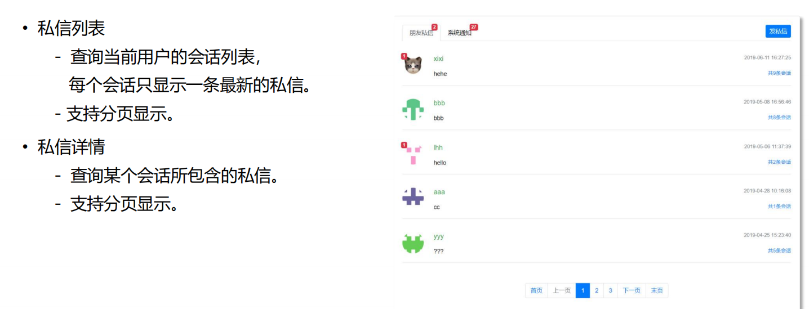

- 私信列表

  - Entity：创建 Message 类
  - Dao：创建 MessageMapper，查询用户会话列表（每个会话只返回一条最新的私信） selectConversations()、查询会话数量 selectConversationsCount()，查询会话所包含的私信列表selectLetters()，查询会话所包含的私信数量 selectLetterCount()，查询总的未读私信数量（以及会话下的未读私信数量） selectLetterUnreadCount()，实现对应 sql
  - Service：创建 MessageService，findConversations()、findConversationCount()、findLetters()、findLetterCount()、findLetterUnreadCount()
  - Controller：创建 MessageController，getLetterList() "/letter/list" 实现 私信列表，成功映射 ”/site/letter“，
  - index：修改index.html 头中消息 的链接，处理 letter.html

- 私信详情

  - Controller：MessageController 下创建 getLetterDetail() "/letter/detail/{conversationId}" 实现 私信详情，成功映射 "/site/letter-detail"
  - index：修改 letter.html 私信列表中消息详情 的链接，处理 letter-detail.html

  

### 3.7、发送私信

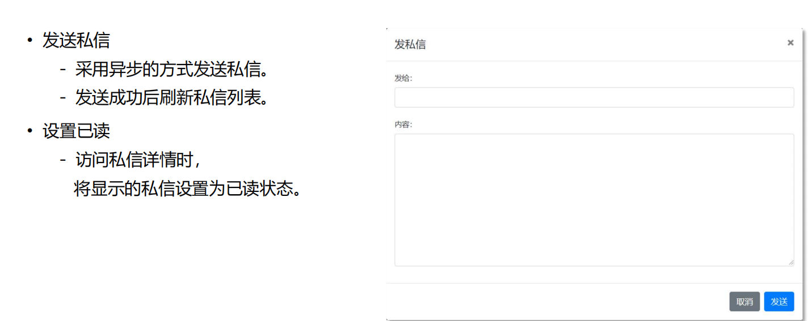

- 发送私信
  - Dao：MessageMapper 下实现增加信息 insertMessage()、改变会话下所有信息状态 updateStatus()，实现对应 sql
  - Service：MessageService 下实现增加信息（转义、过滤） addMessage()，实现改变信息状态 readMessage()
  - Controller：MessageController 下实现发送私信（**异步方式**） sendLetter() "/letter/send"，若目标用户不存在，利用 Json返回 1；存在创建 message返回 0


### 3.8、统一处理异常

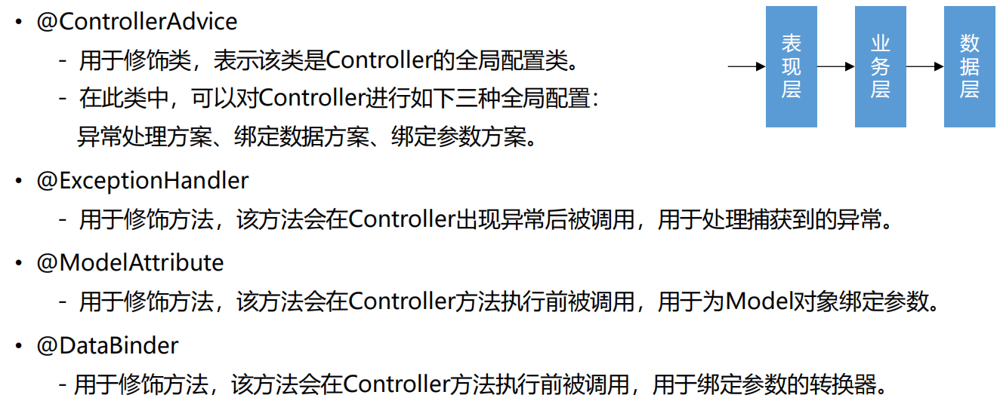

- SpringBoot 自动检测错误页面并跳转：**在templates下创建 error包，以错误状态码命名 html。**比如：在 error下创建 404.html，当访问出现 404的时候会自动跳转当前 404.html
- 创建全局配置类进行全局配置：所有层的异常都会汇集在表现层（Controller），在表现层创建全局配置类统一处理即可
  - 在 controller下创建 advice包、创建 ExceptionAdvice类 `@ControllerAdvice(annotations = Controller.class)`、创建 handleException() `@ExceptionHandler({Exception.class})` 实现统一处理异常：记录日志、根据请求类型做不同的处理


### 3.9、统一记录日志

利用拦截器？针对Controller

利用全局配置？针对Controller，且出现异常后被调用

利用传统方式在业务需求前后添加系统需求？耦合性高、系统需求变化时修改复杂

#### 1、AOP

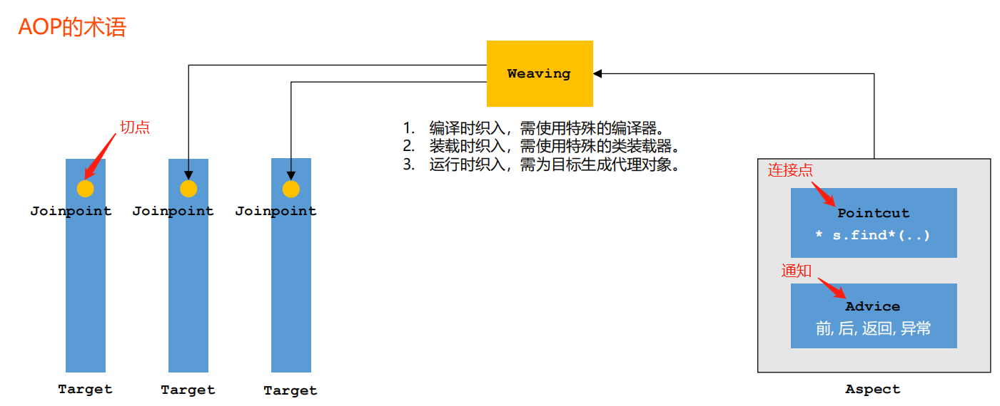


```java
@Component
@Aspect
public class AlphaAspect {

    // 返回值、组件、类、方法、参数
    @Pointcut("execution(* com.nowcoder.community.service.*.*(..))")
    public void pointcut() {} // 定义一个无用的切点

    @Before("pointcut()")
    public void before() {
        System.out.println("before");
    }

    @After("pointcut()")
    public void after() {
        System.out.println("after");
    }

    @AfterReturning("pointcut()")
    public void afterRetuning() {
        System.out.println("afterRetuning");
    }

    @AfterThrowing("pointcut()")
    public void afterThrowing() {
        System.out.println("afterThrowing");
    }

    @Around("pointcut()")
    public Object around(ProceedingJoinPoint joinPoint) throws Throwable {
        System.out.println("around before");
        Object obj = joinPoint.proceed();
        System.out.println("around after");
        return obj;
    }

}

打印结果："around before"、"before"、"around after"、"after"、"afterRetuning"
```


#### 2、记录日志

- 创建 aspect 组件、ServiceLogAspect 类 before() @Before("pointcut()") 记录日志：用户[1.2.3.4] 在[x-x-x  x:x] 访问了 [com.nowcoder.community.service.xxx.xxx()].
  - 获取 ip
  - 获取所访问的 类名、方法名


## 4、Redis，一站式高性能存储方案

官网：https://redis.io/

下载地址：[Releases · microsoftarchive/redis (github.com)](https://github.com/microsoftarchive/redis/releases)

傻瓜式安装、配置环境变量


### 4.2、Spring 整合 Redis

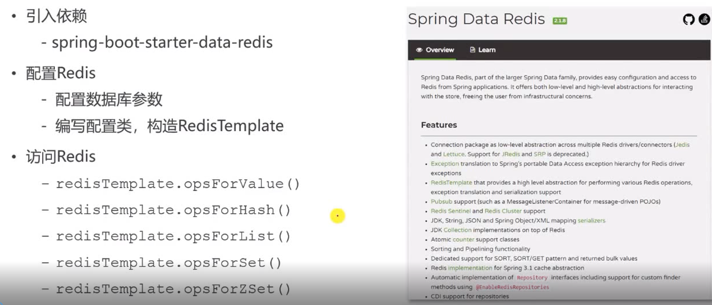

- 引入依赖、参数配置、template配置**（在Config下设置 序列化和反序列化）**

```xml
<!-- https://mvnrepository.com/artifact/org.springframework.boot/spring-boot-starter-data-redis -->
<dependency>
    <groupId>org.springframework.boot</groupId>
    <artifactId>spring-boot-starter-data-redis</artifactId>
    <version>2.2.5.RELEASE</version>
</dependency>
```

```properties
# RedisProperties
spring.redis.database=11
spring.redis.host=localhost
spring.redis.port=6379
```

```java
@Configuration
public class RedisConfig {

    @Bean
    public RedisTemplate<String, Object> redisTemplate(RedisConnectionFactory factory){
        RedisTemplate<String, Object> template = new RedisTemplate<>();
        template.setConnectionFactory(factory);

        // 设置key的序列化方式
        template.setKeySerializer(RedisSerializer.string());
        // 设置value的序列化方式
        template.setValueSerializer(RedisSerializer.json());
        // 设置hash的key的序列化方式
        template.setHashKeySerializer(RedisSerializer.string());
        // 设置hash的value的序列化方式
        template.setHashValueSerializer(RedisSerializer.json());
        
        template.afterPropertiesSet();
        return template;
    }
}
```

- 创建 RedisTests类 测试 redis

  - 五大数据类型：String、Hash、list、Set、SortedSet
  *          Key：操作 key,  绑定 key
  *          编程式事务

  ```java
  @Test
  public void testTransaction() {
      Object result = redisTemplate.execute(new SessionCallback() {
          @Override
          public Object execute(RedisOperations operations) throws DataAccessException {
              // 启用事务
              operations.multi();
              // 具体操作
              ……
              // 提交事务
              return operations.exec();
          }
      });
      System.out.println(result);
  }
  ```


### 4.3、点赞

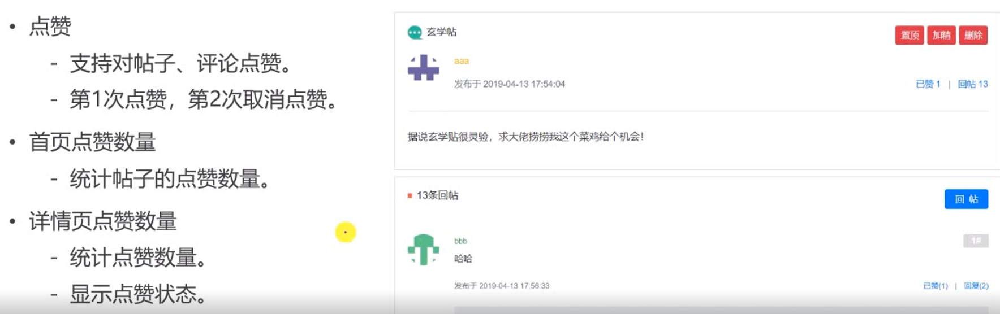


1. 要看帖子、评论（实体）有哪些人赞了，那么这个实体就是 key，它由实体类型和 id所唯一映射，value 就是点赞人的 id，且使用 set类型，即 `like:entity:entityType:entityId <- set(userId)`
2. 点一次点赞，再点一次取消点赞。即判断 userId 是否在 key 中，是说明这个 user对这个 key（实体）点赞了，否未点赞
3. 点赞数量统计这个 key（实体）的 size 即可
4. 任然通过判断 userId 是否在 key 中来判断点赞的状态，而且可以把返回 boolean改成返回 int，通过int来获取点赞状态，比如：0点赞、1已赞、2点彩……
5. 点赞后页面不变化，说明这是异步请求，页面需要显示 点赞数量和点赞状态，因此控制层需要把这两个信息通过异步方式传过去，为方便使用一个 map封装它俩。与 discuss.js交互
6. 在帖子详情中，帖子、评论、回复中都有赞/已赞（数量），于是在post、cvo、rvo中都 put 数量和状态；另外在首页同样显示帖子赞的数量，因此在 map中要 put数量


- Util：创建 RedisKeyUtil类、 getEntityLikeKey() 生成某个实体的赞的 key 			like:entity:entityType:entityId <- set(userId)

- Service：创建 LikeService，分别实现 like()点赞、findEntityLikeCount()查询某实体点赞的数量、findEntityLikeStatus()查询某人对某实体的点赞状态
- Controller：创建 LikeController，like() "/like"，将数量、状态封装后异步传给页面，创建discuss.js 进行交互
- index：在 discuss-detail.html 中修改帖子、评论、回复中赞的显示
- HomeController 的 getIndexPage() 的 map 中加入 ”likeCount“，DiscussPostController 的 getDiscussPost() 的model、commentVo、replyVo中加入 ”likeCount“、 ”likeStatus“


### 4.4、我收到的赞

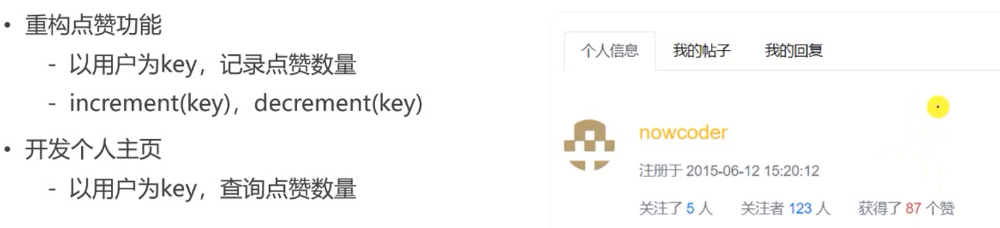


1. 可以通过统计用户帖子、评论赞的数量和来获取收到的赞，这样太麻烦了，直接创建一个方法获取：以用户为 key，记录点赞数量，即 key：String	`like:user:userId -> int`，这个用户为创建实体（帖子、评论）的用户，即被点赞的人
2. 点一次点赞 int+1，再点一次取消点赞 int-1，**这里需要保证事务**
3. 个人主页中要显示用户信息、点赞数量等信息，因此在个人信息页面需要调用获取点赞数量的方法


- 重构点赞功能：
  - Util：RedisKeyUtil 类创建  getUserLikeKey() 生成某个用户的赞  			like:user:userId -> int
  - Service：重构 like()点赞，创建 findUserLikeCount() 查询某个用户获得的赞
  - Controller：重构 LikeController 的 like() 、
  - index：重构 discuss.js、discuss-detail.html
- 开发个人主页
  - Controller：UserController 中创建 getProfilePage() "/profile/{userId}"：显示个人主页信息
  - index：更新 index.html 中头部 跳转个人信息页面、点击头像跳转个人信息，处理 profile.html 页面


### 4.5、关注、取消关注

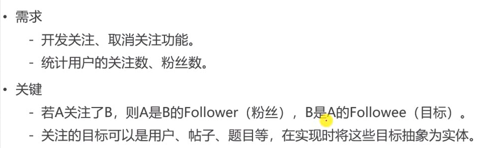

1. 主页上有我的关注、我的粉丝两种，因此不管是关注还是取消关注都应该有两个 key：某个用户关注的实体、某个实体拥有的粉丝
2. 一个是某个用户关注的实体，key是这个用户 id，关注的实体类型和 id，即 `followee:userId:entityType -> zset(entityId,now)`，通常我们查看粉丝或者关注都是按照关注时间来看，因此 value使用有序集合存储所关注实体的 id。
3. 另一个是某个实体拥有的粉丝，key是这个实体id，类型，即 `follower:entityType:entityId -> zset(userId,now)`，同样 value使用有序集合存储粉丝 id。
4. 若用户未登录，应不允许访问，因此使用自定义注解（登录拦截器）来拦截；关注和被关注需保证事务性；在视图层是异步操作
5. 在主页需显示关注数、粉丝数、以及是否关注当前实体，因此需要在 service层补充这三个方法，然后在 UserController获取


- 开发关注、取消关注功能：
  - Util：RedisKeyUtil 类创建  getFolloweeKey() 生成某个用户关注的实体		followee:userId:entityType -> zset(entityId,now)，

    创建  getFollowerKey() 生成某个实体拥有的粉丝			follower:entityType:entityId -> zset(userId,now)

  - Service：创建 FollowService，分别实现 follow() 关注、unfollow() 取消关注，注意事务性

  - Controller：创建 FollowController，follow() "/follow"，unfollow() "/unfollow"，成功后通过Json异步传给页面，创建profile.js 进行交互

  - index：在 discuss-detail.html 中修改帖子、评论、回复中赞的显示

- 统计用户的关注数、粉丝数：

  - Service：FollowService 中创建 findFolloweeCount() 查询关注的实体的数量、findFollowerCount() 查询实体的粉丝的数量、hasFollowed() 查询当前用户是否已关注该实体
  - Controller：完善 UserController 中 getProfilePage() "/profile/{userId}"
  - index：处理 profile.html 


### 4.6、关注列表、粉丝列表

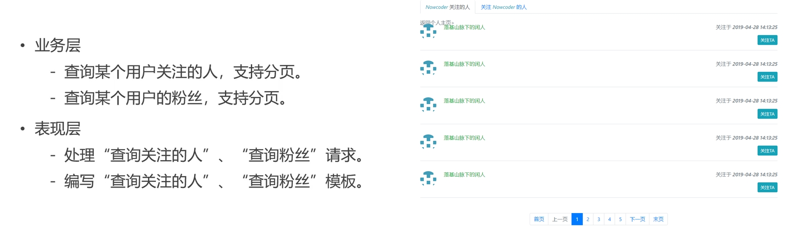

1. 页面需显示 xxx关注的人和关注xxx的人，因此 model需添加 user来获取 xxx 的信息
2. 还要显示所关注的人的头像、名字，因此需要关注的人 followee 的信息（ZSet 中的 value 为关注人的 id），还需关注时间（ZSet 中的 score），以及我是否关注了这个人，可以将这三个封装到 map中
3. 因此业务层主要处理 关注列表 和 粉丝列表，还有分页（offser、limit）。至于 user信息，访问谁的主页谁就是 user，将其通过 url传进来即可


- Service：FollowService 中创建 findFollowees() 查询某用户关注的人、findFollowers() 查询某用户的粉丝 。 （处理分页）
- Controller：FollowController中创建 getFollowees() "/followees/{userId}" 实现关注列表，成功跳转 "/site/followee"、getFollowers() "/followers/{userId}" 实现粉丝列表，成功跳转 "/site/follower"
- index：profile.html 跳转 followee.html、follower.html 部分，以及处理 followee.html、follower.html 


### 4.7、优化登录模块

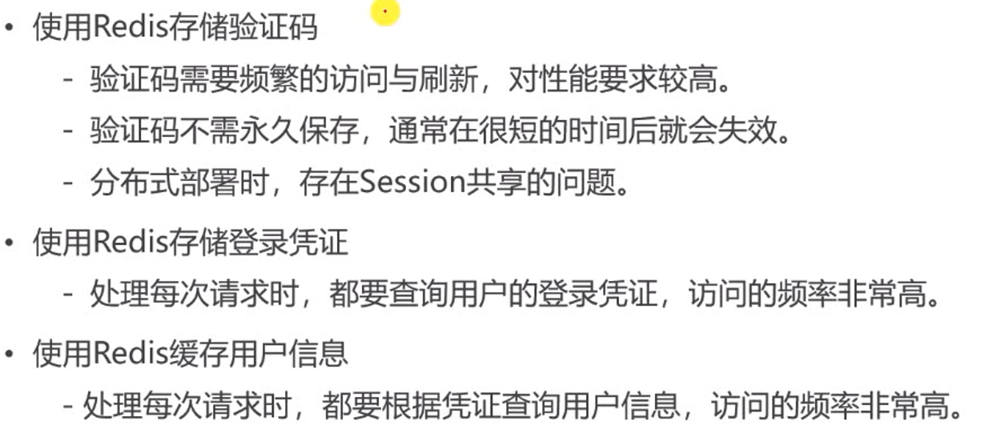

- 使用 Redis存储验证码 kaptcha

  - RedisKeyUtil 中创建 getKaptchaKey()，LoginController 中 修改 getKaptcha() 、login() （验证码的存储位置session变成redis）

  1. 之前生成验证码 kaptcha后存入 session中，登录时检查验证码又从 session中获取。存在 session中具有一系列问题，而 redis会部署在单独的服务器上（session存储在应用服务器内存中）
  2. 存在 redis 中需要创建 kaptche（value）所对应的 key，理论上是用 userId 作为 key，与验证码一一对应，但是在此阶段用户还未登录，不能获取 userId，因此创建一个随机的字符串作为 key，存在 redis 服务器中
  3. 应用服务器在登录时需要检查验证码，因此它需要随机字符串 key来获取验证码，因此这个key创建好后要存入 cookie中，供应用服务器使用

  

- 使用 Redis存储登录凭证 ticket

  - RedisKeyUtil 中创建 getTicketKey()，UserService 中 修改 login() 

  1. 之前使用凭证是有一个凭证实体 LoginTicket，里面存了 id、ticket（用户登录时随机创建的字符串）、status（1无效）；然后通过增加凭证、根据 ticket查询凭证、修改凭证状态这几个方法（sql）在数据集操作
  2. 现在要将 凭证存在redis中，那么 key是 ticket，value是 loginTicket；由于是在 redis中，那么 dao层就不需要了，service层要操作 ticket，重新实现增加凭证、根据 ticket查询凭证、修改凭证状态这些功能即可
  3. 退出登录不删除凭证，只修改凭证状态（status=1），给后续开发使用


- 使用 Redis缓存用户信息

  - RedisKeyUtil 中创建 getUserKey()，UserService 中 增加 getCache()、initCache()、clearCache()

  1. 由于使用 Redis **缓存**用户信息，不是存储，那么逻辑就是：优先从缓存中取值，取不到时初始化缓存数据，数据变更时清楚缓存数据。
  2. 在 service层实现这几个方法，然后在通过 id查用户增加功能：优先从缓存中取值，取不到时初始化缓存数据；修改用户状态的地方增加功能：数据变更时清楚缓存数据


## 5、Kafka，构建TB级异步消息系统


### 5.1、Kafka入门

http://kafka.apache.org

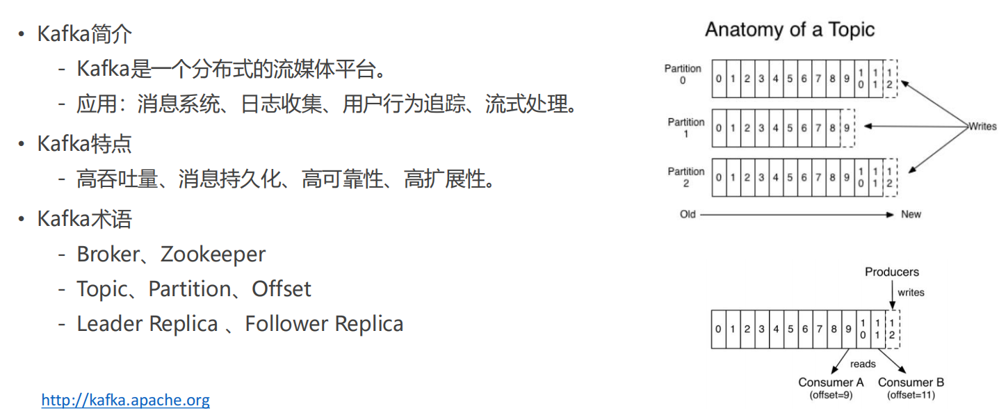


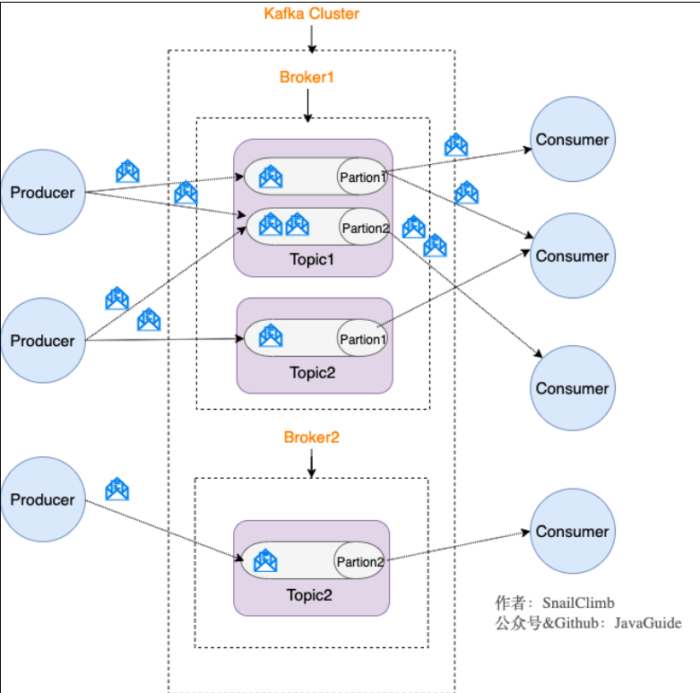

- 修改 config 下 zookeeper.properties 的记录保存路径：dataDir=D:/Data/newcoder/zookeeper

- 修改 config 下 server.propertity 的 kafka日志保存路径：log.dirs=D:/Data/newcoder/kafka-logs

- 启动服务器 （先启动 zookeeper服务器，再启动 kafka，分别在不同命令行） **！！！千万不要手动暴力关闭，用下面的命令关闭**：

  ```xml
  启动命令行，cmd到 kafka安装目录下: d:\work\Kafka\kafka_2.12-2.2.0
  bin\windows\kafka-server-start.bat config\server.properties
  bin\windows\zookeeper-server-start.bat config\zookeeper.properties
  ```

- 使用kafka：启动新的命令行，cmd到 kafka安装目录下：d:\work\Kafka\kafka_2.12-2.2.0\bin\windows

  - 创建主题（点赞、评论是不同的主题）：在端口号为9092这个服务器上，创建一个test主题，其有一个副本，一个分区

  ```xml
  kafka-topics.bat --create --bootstrap-server localhost:9092 --replication-factor 1 --partitions 1  --topic test
  ```

  - 查看当前服务器的主题

  ```xml
  kafka-topics.bat --list --bootstrap-server localhost:9092
  ```

  - 创建生产者，往指定主题上发消息

  ```xml
  kafka-console-producer.bat --broker-list localhost:9092 --topic test
  ```

  - 消费者接收消息：启动新的命令行，cmd到 kafka安装目录下：d:\work\Kafka\kafka_2.12-2.2.0\bin\windows

  ```xml
  kafka-console-consumer.bat --bootstrap-server localhost:9092 --topic test --from-beginning
  ```

- 关闭 zookeeper服务器 、kafka服务器

  ```xml
  zookeeper-server-stop.bat
  kafka-server-stop.bat
  ```


### 5.2、Spring整合Kafka

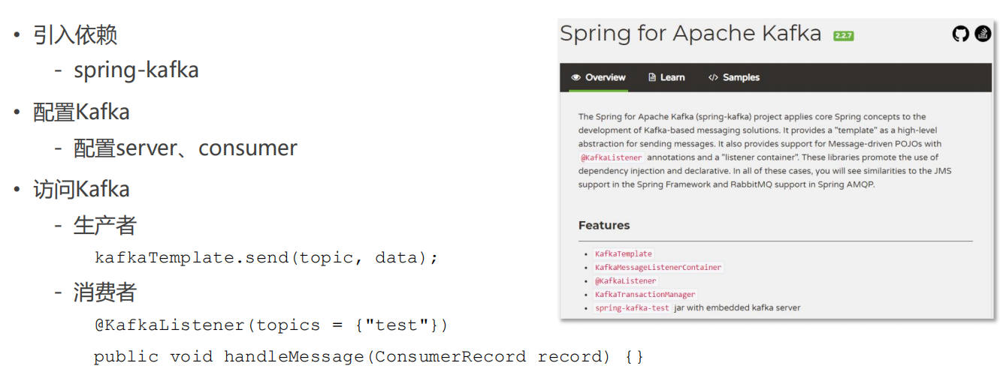

- 引入依赖

```xml
<!-- https://mvnrepository.com/artifact/org.springframework.kafka/spring-kafka -->
<dependency>
    <groupId>org.springframework.kafka</groupId>
    <artifactId>spring-kafka</artifactId>
    <version>2.8.2</version>
</dependency>
```

- 配置Kafka

```properties
# KafkaProperties group-id在 consumer.properties中，
spring.kafka.bootstrap-servers=localhost:9092
spring.kafka.consumer.group-id=test-consumer-group
spring.kafka.consumer.enable-auto-commit=true
spring.kafka.consumer.auto-commit-interval=3000
```

访问Kafka，**生产者发消息是主动调用，消费者被动接收**

```java
/**
 * @Author: ZhuJiang
 * @Date: 2022/5/12 10:58
 * @Version: 1.0
 * @Description: Kafka 示例
 */
@SpringBootTest
@ContextConfiguration(classes = CommunityApplication.class)
public class KafkaTests {
    @Autowired
    private KafkaProducer kafkaProducer;

    @Test
    public void testKafka(){
        kafkaProducer.sendMessage("test", "你好");
        try {
            Thread.sleep(1000*10);
        } catch (InterruptedException e) {
            e.printStackTrace();
        }
        kafkaProducer.sendMessage("test", "在吗");
    }
}

@Component
class KafkaProducer {

    @Autowired
    private KafkaTemplate kafkaTemplate;

    public void sendMessage(String topic, String content) {
        kafkaTemplate.send(topic, content);
    }
}

@Component
class KafkaConsumer {
    
    @KafkaListener(topics = {"test"})
    
    public void handleMessage(ConsumerRecord record) {
        System.out.println(record.value());
    }
}
```


### 5.3、发送系统通知

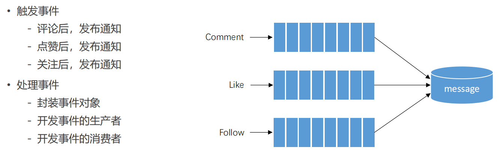

1. 当触发了某个事件，系统就像你发送通知，比如比如给你点赞，系统会发通知给你 xx点赞了你的xx（实体），因此首先要封装这个事件对象（event）。
2. 事件中有哪些属性：事件类型（是点赞还是关注，topic）、谁触发了这个事件（userId）、触发的事件实体（是帖子还是评论 entityType、entityId）、触发了谁的事件（entityUserId）、以及其他 data（放在一个 map里），为后续增加功能时准备（比如别人不管是赞了你的帖子还是评论，存入post可以链接到帖子页面）
3. 开发事件生产者的处理（把 event发出去）：利用 KafkaTemplate 发送 event  `kafkaTemplate.send(topic, Object)`，利用 Json将 event对象转换成 String
4. 开发事件消费者的处理：消费者接收到的是一个 ConsumerRecord对象，首先我们判断这个 record是否为空，不为空后利用 Json将 String反转成 event对象，判断这个 event对象是否为空，接下来开始处理这个 event。
5. 因为最后是要 被触发的实体的用户（entityUserId）收到消息，因此我们借用 Message实体（fromId、toId、conversationId、content、createTime），将event里的内容封装到 Message中。fromId 即系统，可定义一个常量设置为1。toId 即 被触发的实体的用户（entityUserId）。传统的 conversationId是fromId_toId 这种形式，但在这里我们使用事件类型（topic）。消息内容 content则封装 event中的属性，包括data（这个data是一个map，是event为后续增加功能时提前准备的）
6. 最后调用 messageService.addMessage() 添加这个封装了 event的 message，供触发使用，接下来开发触发事件对应的 Controller
7. 分别在CommentController、LikeController、FollowController 各事件生产者中 触发相应的事件（评论、点赞、关注） 后 进行处理（设置 event发出去）


- 处理事件
  - entity：创建 Event实体类
  - 生产者处理：创建 EventProducer，sendMessage()，把 event发出去
  - 消费者处理：创建EventConsumer，handleMessage()，把 event装入 message发送通知
- 触发事件
  - 在 CommentController 的 addComment() 中触发评论事件，其中要把 post传进 data中
  - 在 LikeController的 like() 中触发点赞事件，其中要把 post传进 data中，原方法中没有 post，那就提供 post，在视图层赋予
  - 在 FollowController的 follow() 中触发关注事件


### 5.4、显示系统通知

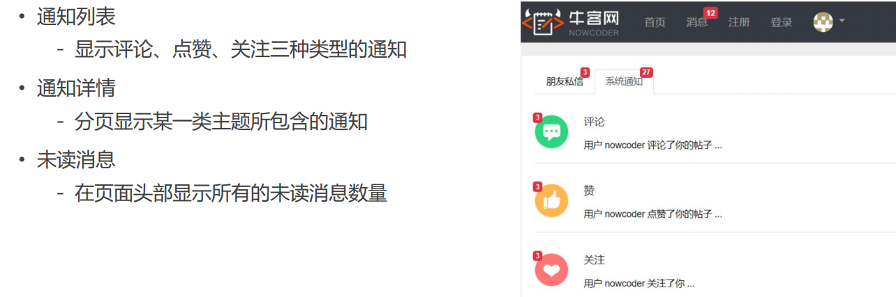

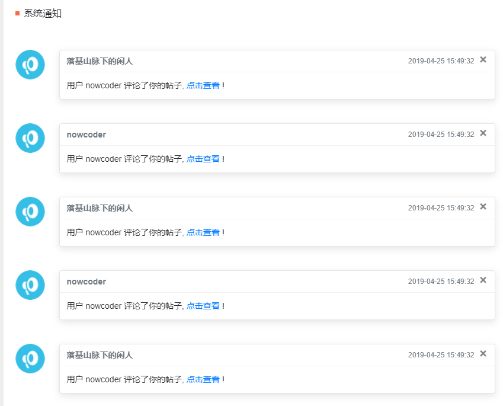

1. 通知（notice）和详情列表可仿照之前的 消息（message）及其详情列表 的处理方式来处理
2. 首先处理通知列表和未读消息，通知列表主要显示三个主题下的最新帖子以及相关信息（比如entieyId、entityType，这些信息message中的content中有了，即event），因此提供3个相应的mapper：查询某个主题最新的通知、查询某个主题通知的数量（共几条会话）、查询未读通知的数量（包含总的和各主题下的）
3. mapper写好后写Controller，把各主题下 最新的通知（message）、通知数量、未读通知数量、以及 message的 content（content里面存的是event，有 userId、entityType、data这些信息） 等存入一个map容器（messageVO、likeVO、followVO）中，然后把这三个map容器以及 总的未读通知数量 存入model中，供模板引擎取
4. 最后处理 通知详情，通知详情和私信详情处理基本一致，提供一个 查询通知所包含的消息列表 的mapper，之后在 controller层 分页、装配、已读。在装配时按步骤3 装（装入userId、entityType、data这些信息）


- 通知列表


# 日志

Logback：https://logback.qos.ch

## 1、配置

将下面 xml 文件复制到 resources 下并命名为 logback-spring.xml 会被springboot自动检测

```xml
<?xml version="1.0" encoding="UTF-8"?>
<configuration>
    <contextName>community</contextName>
    <!--部署在 D:/Data/newcoder/workspace/community 下的 logback 目录下-->
    <property name="LOG_PATH" value="D:/Data/newcoder/workspace/community"/>
    <property name="APPDIR" value="logback"/>

    <!-- error file -->
    <appender name="FILE_ERROR" class="ch.qos.logback.core.rolling.RollingFileAppender">
        <file>${LOG_PATH}/${APPDIR}/log_error.log</file>
        <rollingPolicy class="ch.qos.logback.core.rolling.TimeBasedRollingPolicy">
            <fileNamePattern>${LOG_PATH}/${APPDIR}/error/log-error-%d{yyyy-MM-dd}.%i.log</fileNamePattern>  <!--文件命名-->
            <timeBasedFileNamingAndTriggeringPolicy class="ch.qos.logback.core.rolling.SizeAndTimeBasedFNATP">
                <maxFileSize>5MB</maxFileSize>      <!--文件最多存5M，满了就滚动创建新的文件-->
            </timeBasedFileNamingAndTriggeringPolicy>
            <maxHistory>30</maxHistory>     <!--最高存30天的数据-->
        </rollingPolicy>
        <append>true</append>           <!--以追加、非覆盖形式存-->
        <encoder class="ch.qos.logback.classic.encoder.PatternLayoutEncoder">
            <pattern>%d %level [%thread] %logger{10} [%file:%line] %msg%n</pattern>
            <charset>utf-8</charset>
        </encoder>
        <!--过滤器，只筛选error级别的日志-->
        <filter class="ch.qos.logback.classic.filter.LevelFilter">
            <level>error</level>
            <onMatch>ACCEPT</onMatch>
            <onMismatch>DENY</onMismatch>
        </filter>
    </appender>

    <!-- warn file -->
    <appender name="FILE_WARN" class="ch.qos.logback.core.rolling.RollingFileAppender">
        <file>${LOG_PATH}/${APPDIR}/log_warn.log</file>
        <rollingPolicy class="ch.qos.logback.core.rolling.TimeBasedRollingPolicy">
            <fileNamePattern>${LOG_PATH}/${APPDIR}/warn/log-warn-%d{yyyy-MM-dd}.%i.log</fileNamePattern>
            <timeBasedFileNamingAndTriggeringPolicy class="ch.qos.logback.core.rolling.SizeAndTimeBasedFNATP">
                <maxFileSize>5MB</maxFileSize>
            </timeBasedFileNamingAndTriggeringPolicy>
            <maxHistory>30</maxHistory>
        </rollingPolicy>
        <append>true</append>
        <encoder class="ch.qos.logback.classic.encoder.PatternLayoutEncoder">
            <pattern>%d %level [%thread] %logger{10} [%file:%line] %msg%n</pattern>
            <charset>utf-8</charset>
        </encoder>
        <filter class="ch.qos.logback.classic.filter.LevelFilter">
            <level>warn</level>
            <onMatch>ACCEPT</onMatch>
            <onMismatch>DENY</onMismatch>
        </filter>
    </appender>

    <!-- info file -->
    <appender name="FILE_INFO" class="ch.qos.logback.core.rolling.RollingFileAppender">
        <file>${LOG_PATH}/${APPDIR}/log_info.log</file>
        <rollingPolicy class="ch.qos.logback.core.rolling.TimeBasedRollingPolicy">
            <fileNamePattern>${LOG_PATH}/${APPDIR}/info/log-info-%d{yyyy-MM-dd}.%i.log</fileNamePattern>
            <timeBasedFileNamingAndTriggeringPolicy class="ch.qos.logback.core.rolling.SizeAndTimeBasedFNATP">
                <maxFileSize>5MB</maxFileSize>
            </timeBasedFileNamingAndTriggeringPolicy>
            <maxHistory>30</maxHistory>
        </rollingPolicy>
        <append>true</append>
        <encoder class="ch.qos.logback.classic.encoder.PatternLayoutEncoder">
            <pattern>%d %level [%thread] %logger{10} [%file:%line] %msg%n</pattern>
            <charset>utf-8</charset>
        </encoder>
        <filter class="ch.qos.logback.classic.filter.LevelFilter">
            <level>info</level>
            <onMatch>ACCEPT</onMatch>
            <onMismatch>DENY</onMismatch>
        </filter>
    </appender>

    <!-- console -->
    <appender name="STDOUT" class="ch.qos.logback.core.ConsoleAppender">
        <encoder>
            <pattern>%d %level [%thread] %logger{10} [%file:%line] %msg%n</pattern>
            <charset>utf-8</charset>
        </encoder>
        <filter class="ch.qos.logback.classic.filter.ThresholdFilter">
            <level>debug</level>
        </filter>
    </appender>

    <!-- 单独声明项目（com.nowcoder.community包）下的日志级别为 debug -->
    <logger name="com.nowcoder.community" level="debug"/>

    <root level="info">
        <appender-ref ref="FILE_ERROR"/>
        <appender-ref ref="FILE_WARN"/>
        <appender-ref ref="FILE_INFO"/>
        <appender-ref ref="STDOUT"/>
    </root>

</configuration>
```


## 2、使用

通常在test包下创建 `LoggerTests `使用

**注意：选择` slf4j.Logger 和 slf4j.LoggerFactory`**

```java
public class LoggerTests {
    private static final Logger logger = (Logger) LoggerFactory.getLogger(LoggerTests.class);
    @Test
    public void testLogger() {
        System.out.println(logger.getName());
        logger.debug("debug log");
        logger.info("info log");
        logger.warn("warn log");
        logger.error("error log");
    }
}
```


# Themleaf

## 1、引入名称空间

<html lang="en" xmlns:th="http://www.thymeleaf.org">


## 2、表达式

- ${}:变量表达式

- *{} ：选择变量表达式

- {...} : Message 表达式


## 3、URL

- 绝对网站

  - 绝对URL用于创建到其他服务器的链接,它们需要指定一个协议名称(http://或https://)开头

    ```html
  <a th:href="@{https://www.campsis-tk.top/}"> 
    ```
  
- 上下文相关url

  - 与Web应用程序根相关联URL

    ```html
  <a th:href="@{/hello}">跳转</a>
    ```
  
- 与服务器相关url

  - 服务器相关的URL与上下文相关的URL非常相似

    ```html
  <a th:href="@{~/hello}">跳转</a>
    ```
  
- 携带参数

  ```html
  <a th:href="@{/hero/detail(id=3,action='show')}">aa</a>
  ```


## 4、字面值

- 有的时候，我们需要在指令中填写基本类型如：字符串、数值、布尔等，并不希望被Thymeleaf解析为变量，这个时候称为字面值。

- 字符串字面值

  ```html
  <p>
      内容：<span th:text="'Demo'+1">template</span>
  </p>
  ```

- 数字字面值

  ```html
  <p>
      内容：<span th:text="2+1">template</span>
  </p>
  ```

- 布尔字面值

  - 布尔类型的字面值是true或false


## 5、拼接

- 普通字符串与表达式拼接的情况

  ```html
  <span th:text="'欢迎您：' + ${person.name} + '!'"></span>
  ```

- 字符串字面值需要用''，拼接起来非常麻烦，Thymeleaf对此进行了简化，使用一对|即可

  ```html
  <span th:text="|欢迎您：${person.name}!|"></span>
  ```


## 6、运算符

- 算术操作符

  > 加(+)、减(-)、乘(*)、除(/)、取余(%)

- 比较运算

  > 1. 大于(>)、小于(<)、大于或等于(>=)、小于或等于(<=)
  > 2. 但是大于(>)、小于(<)不能直接使用，因为xml会解析为标签
  > 3. 大于(gt)、小于(lt)、大于或等于(ge)、小于或等于(le)
  > 4. 

- 三元运算

  ```html
  <span th:text="${true}?'男':'女'"></span>
  ```

- 内联写法

```html
<span>sapn标签([(${person.name})])</span>
```

```html
<span>sapn标签[[${person.name}]]</span>
```

- 局部变量

```html
<div th:with="person = ${allPerson[0]}">
    <h1 th:text="${person.name}"></h1>
    <h1 th:text="${person.age}"></h1>
    <h1 th:text="${person.sex}"></h1>
</div>
```


## 7、th 属性

Thymeleaf 还提供了大量的 th 属性，这些属性可以直接在 HTML 标签中使用，其中常用 th 属性及其示例如下表。

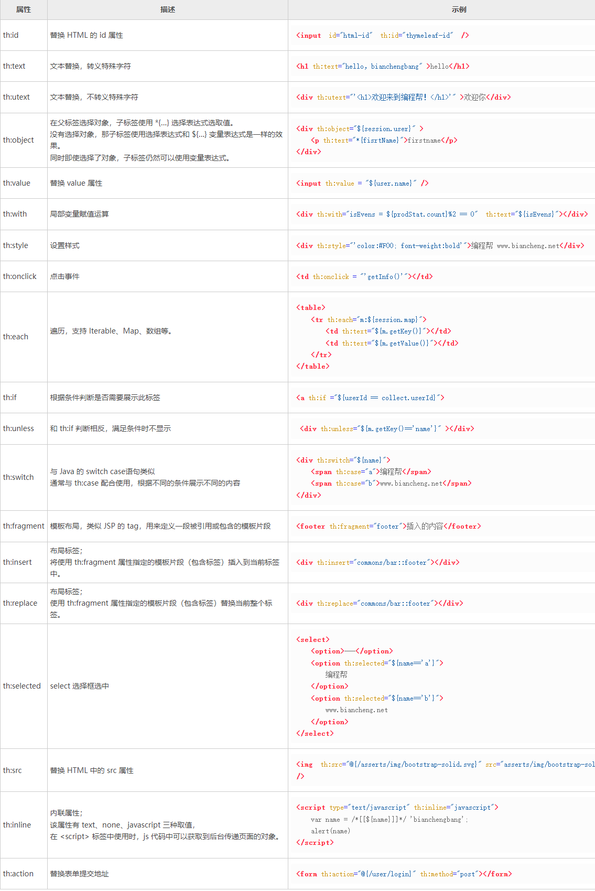

```html
th:each="cvo:${comments}"
${cvoStat.count} 表示所遍历comments的第几个cvo
href="javascript:;" 使超链接失效
```

